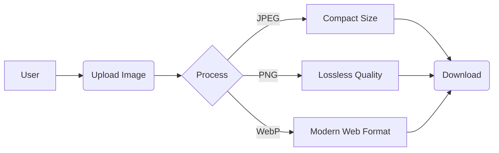

# ⚡ Photo Size Reducer

> **Optimize Images Instantly. Fast, Secure, and Client-Side.**  
> *Reduce file size locally without losing quality.*

 
 

---

## 🌟 Overview

**Photo Size Reducer** is a modern, web-based tool designed to help you compress and resize images effortlessly. Built with a stunning **Glassmorphism UI** and powered by robust client-side logic, it ensures your photos are processed **instantly** within your browser—no server uploads required!

Whether you're a developer optimizing assets or a photographer saving space, this tool delivers **premium performance** with a **cyber-aesthetic** feel.

---

## 🚀 Key Features

-   **🎨 Premium Glassmorphism UI**: A sleek, dark-themed interface with animated backgrounds and blur effects.
-   **🔒 100% Client-Side**: Your images **never** leave your device. Privacy first!
-   **⚡ Instant Compression**: Powered by the Canvas API for lightning-fast processing.
-   **🔄 Format Conversion**: Convert between **JPEG**, **PNG**, and **WebP** on the fly.
-   **📱 Fully Responsive**: Optimized for desktops, tablets, and mobile devices.
-   **👌 Drag & Drop**: Seamlessly drag images or click to upload.
-   **📉 Smart Size Estimation**: Real-time preview of the compressed file size.

---

## 🛠️ Tech Stack

This project works purely on standard web technologies:

| Tech | Usage |
| :--- | :--- |
| **HTML5** | Semantic structure and layout. |
| **CSS3** | Animations, Flexbox, Grid, and Glassmorphism effects. |
| **JavaScript** | Core logic, Image processing (`Canvas`), and Event handling. |
| **FontAwesome** | Beautiful vector icons. |
| **Google Fonts** | "Outfit" typeface for a modern look. |

---

## 📸 Usage Guide

1.  **Open the App**: Launch `index.html` in any modern browser.
2.  **Upload**: Drag & drop your image into the glass box, or click **"Choose File"**.
3.  **Customize**:
    -   Adjust **Quality** slider.
    -   Set max **Width/Height** (optional).
    -   Select **Output Format** (JPEG/PNG/WebP).
4.  **Preview**: See the *Original* vs *Result* instantly.
5.  **Download**: Click the **Download** button to save your optimized image!

---

## ✨ Interface Preview

---

## 👨‍💻 Author

**Piyush Kadam**  
*Full Stack Developer & UI Enthusiast*

---

## 🛡️ License

This project is licensed under the MIT License - see the LICENSE file for details.

> *© 2025 PhotoReducer. Don't copy this website. All rights reserved.*
